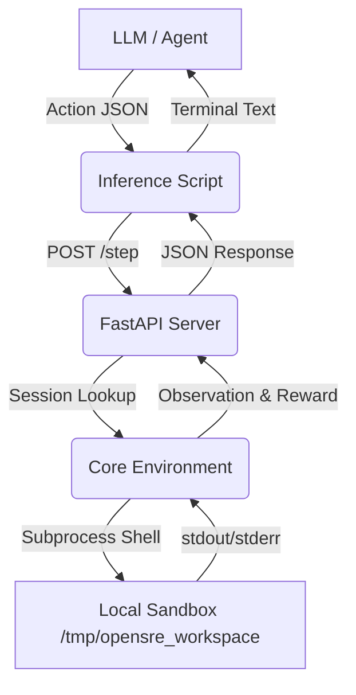

# OpenSRE: Autonomous DevOps & RL Agent Environment

## 1. Executive Summary

**OpenSRE** is a stateless, containerized Reinforcement Learning environment designed to evaluate the capability of Large Language Models (LLMs) and autonomous agents in acting as Site Reliability Engineers (SREs). 

While most agentic benchmarks evaluate static code generation, OpenSRE forces the agent to navigate a live, broken Linux environment, execute bash commands, parse standard output/error, and fix infrastructure or code issues. The environment is built to be compliant with the Meta OpenEnv specification.

---

## 2. Architecture Overview

The project is structured into four primary components:

1. **Domain Models (`models.py`)**: Strict typing for Actions, Observations, Rewards, and internal State using Pydantic.
2. **Core Environment (`env.py`)**: The simulation engine that creates the sandbox, orchestrates the tasks, executes agent commands, and calculates dense rewards.
3. **API Server (`server/app.py`)**: A FastAPI layer wrapping the environment, allowing concurrent evaluations through isolated session management.
4. **Inference / Evaluation (`inference.py`)**: A script that connects an LLM to the API Server to run the benchmark autonomously.



---

## 3. Deep Dive: Core Environment (`env.py`)

The core of OpenSRE lies in `env.py`. It is responsible for setting up a realistic, interactive scenario.

### 3.1 Workspace Setup
Every time `reset()` is called, the environment:
- Forcibly kills any lingering background processes (Flask, zombies, workers).
- Destroys and recreates a clean sandbox directory at `/tmp/opensre_workspace`.
- Generates `flask_app.py`, which is the primary web server the agent must fix.
- Generates a `restart.sh` script to simulate the standard SRE operation of restarting services after a fix.

### 3.2 Task Scenarios and Decoys
To prevent simple memorization by LLMs, the environment dynamically injects the root cause along with procedural **decoys**.

*   **Easy (Disk Full):** The server crashes due to a massive `logs/error.log` filling up the disk. 
    *   *Decoys:* `access.log` and `system.log` are present but harmless.
*   **Medium (Bad Config):** The server fails to connect to a database because `src/config.py` contains `"bad_password"`.
    *   *Decoys:* `src/utils.py` contains valid utility code to distract the agent.
*   **Hard (CPU Spike / Zombie):** A `src/zombie.py` process is running an infinite loop, causing a timeout on the health check.
    *   *Decoys:* `worker_1.py` through `worker_3.py` are valid background processes that simply sleep. The agent must selectively identify and kill only the zombie.

---

## 4. State Machine and Data Models (`models.py`)

The environment adheres to a strictly typed interface, ensuring robust inputs and outputs.

### 4.1 Action Space
Agents must output a JSON object containing a `command` string. This string is executed directly in the sandbox's shell (with a timeout).

### 4.2 Observation Space
After each action, the agent receives an `SREObservation` containing:
- `stdout` and `stderr` (truncated to 1500 chars).
- `exit_code` (0 for success).
- `server_health_status`: The HTTP status code of the local web server (`200` means it's fixed!).
- `last_action_error`: Indicates if the bash execution itself failed (e.g., timeout).

### 4.3 Internal State (`SREState`)
The environment maintains hidden variables to track milestones and prevent exploitation:
- `step_count`: Terminates the episode if it exceeds `max_steps` (15).
- `last_command`: Used to penalize the agent if it spams the exact same command repeatedly.
- `discovered_log_file` / `identified_rogue_pid`: Boolean flags that unlock one-time milestone rewards.

---

## 5. Grading and Reward Shaping

OpenSRE uses a dense, deterministic reward shaping mechanism rather than a sparse binary pass/fail. This is critical for Reinforcement Learning to provide gradient signals.

1.  **Step Penalty (-0.05):** Every action costs a small penalty. Efficiency is encouraged.
2.  **Anti-Spam Penalty (-0.05):** If the agent repeats the exact same command, it is penalized further to break out of LLM repetitive loops.
3.  **Milestone Rewards (+0.20):** 
    *   Given when the agent reads the error log in the Easy task.
    *   Given when the agent uses `ps`, `top`, or `pgrep` in the Hard task.
4.  **Terminal Reward:** 
    *   If the agent successfully restores the server (Health check returns 200), it receives a massive bonus based on how few steps it took.
    *   *Mathematical Bounding:* The final score is strictly clamped between `0.01` and `0.99`. This prevents infinity errors in Log-Loss calculations during standard LLM benchmarking.

---

## 6. The API Server (`server/app.py`)

The FastAPI application provides a RESTful interface to the environment. 
Crucially, it implements **UUID-based session isolation**.

When `/reset` is called, it returns a `session_id`. All subsequent calls to `/step` must include this `session_id`. This allows multiple evaluation scripts to test different models or prompts concurrently against the same API server without their environments interfering with one another.

### Endpoints
*   `GET /health`: Server status.
*   `POST /reset`: Resets a task (accepts `{"task_level": "easy"}`). Returns initial observation and `session_id`.
*   `POST /step`: Executes an action (accepts `{"session_id": "...", "command": "ls"}`). Returns the observation, reward, and done flag.

---

## 7. Inference & Evaluation Loop (`inference.py`)

This script acts as the automated grader. It simulates a ReAct (Reasoning + Acting) loop using the OpenAI SDK (which can also point to Hugging Face or custom endpoints via `API_BASE_URL`).

### The ReAct Loop
1.  **Prompting:** The LLM is provided with a system prompt detailing its role and valid commands, followed by the latest terminal output, step count, and a hint to use `restart.sh`.
2.  **Parsing:** The script robustly extracts the JSON action from the LLM's response using basic substring finding (`parse_action()`), falling back to `ls` if the LLM hallucinates formatting.
3.  **Execution:** The extracted command is sent to the FastAPI server via `/step`.
4.  **Termination:** The loop breaks when the environment returns `done=True` (either successfully resolved or out of steps). The final score is calculated based on cumulative rewards and clamped.

---

## 8. Setup and Usage

### Installation
```bash
git clone https://github.com/mithilesh1729/opensre-hackathon.git
cd opensre-hackathon
pip install -r requirements.txt
```

### Running the Environment API
Start the FastAPI server (runs on port `7860` by default):
```bash
python server/app.py
```

### Running the Benchmark
Ensure your API keys are set. By default, it uses `gpt-4o-mini`.
```bash
export OPENAI_API_KEY="your-openai-api-key"
# OR for Hugging Face endpoints:
# export HF_TOKEN="your-hf-token"
# export API_BASE_URL="https://api-inference.huggingface.co/v1/"

python inference.py
```

### Baseline Performance
*(Using `gpt-4o-mini`)*
*   **Easy:** ~0.99 (Solved in ~4 steps)
*   **Medium:** ~0.89 (Solved in ~6 steps)
*   **Hard:** ~0.65 (Often resolves, but takes many steps or receives penalties)
*   **Overall:** ~0.84